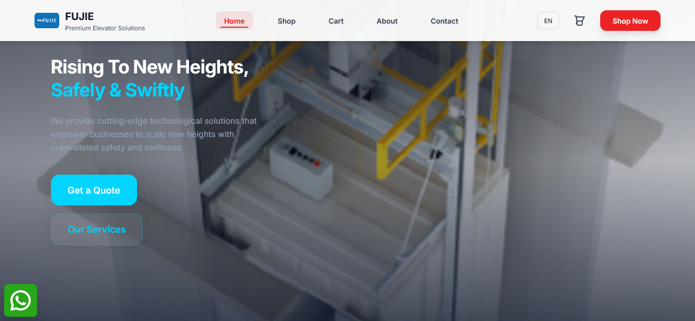

# 🚀 Elevator Sales Website

An E-commerce web application for showcasing and selling elevators.  
Built with **React.js** and designed to provide a clean, responsive, and user-friendly shopping experience.  

---

## 🌐 Live Demo
🔗 [View Project Here](fuji-iota.vercel.app)  


---

## 📸 Screenshots

### Homepage


### Product Page


### Shopping Cart & Checkout


---

## ✨ Features
- 🛒 **Product Catalog** – Browse elevators with detailed product pages.  
- 🛍️ **Shopping Cart** – Add, remove and products easily.  
- 💳 **Stripe Checkout Integration** – Secure and simple checkout flow (Test mode).  
- 📱 **Responsive Design** – Works perfectly on desktop, tablet, and mobile.  
- 🌍 **Multi-language Ready** – English + Arabic UI support.  

---

## 🛠️ Tech Stack
- **Frontend:** React.js, React Router, TailwindCSS  
- **Deployment:** Vercel (Frontend)
- **Version Control:** Git & GitHub  

---

## ⚡ Installation & Setup

Clone the repository:
```bash
git clone https://github.com/USERNAME/REPO.git
cd REPO
